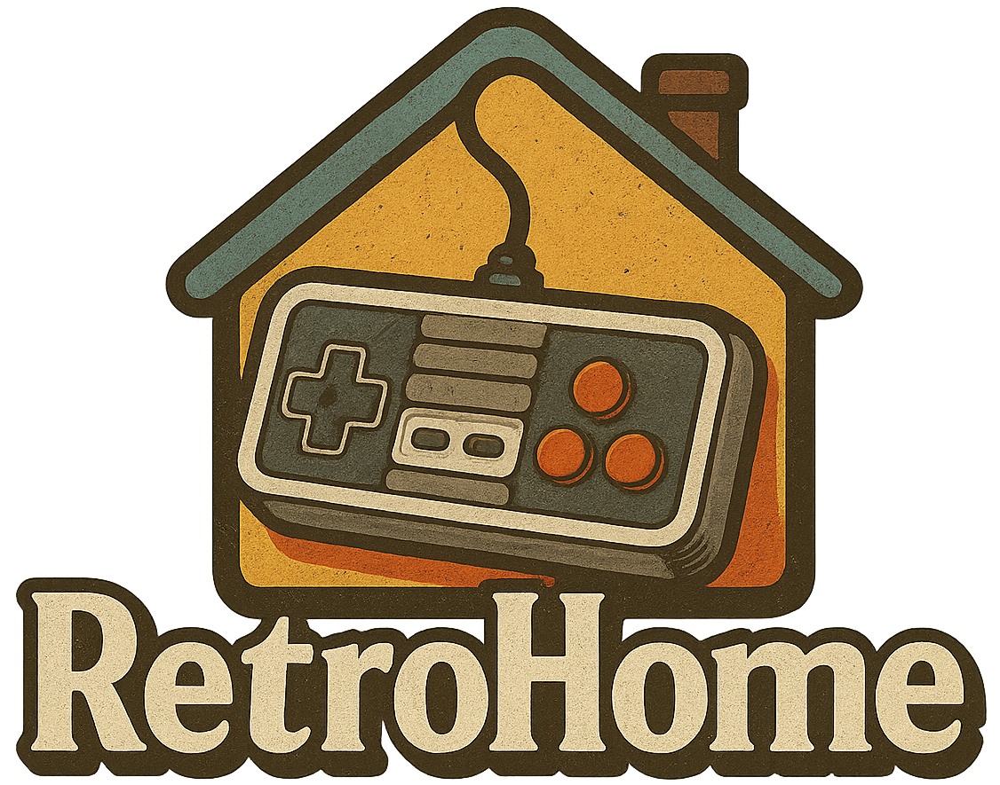

# RetroHome 🕹️ - Votre Plateforme de Jeux Rétro en Ligne

[](https://opensource.org/licenses/MIT) <!-- Adapte la licence si besoin -->
<!-- Ajoute d'autres badges si pertinent (Build Status, etc.) -->

<p align="center">
  
</p>

Revivez la magie des classiques ! RetroHome est une plateforme web open-source vous permettant de jouer à vos jeux vidéo rétro préférés directement dans votre navigateur. Gérez votre bibliothèque, découvrez de nouveaux titres, organisez vos favoris et partagez la nostalgie.

<!-- Optionnel: Ajoute une ou deux captures d'écran ici -->
<!--
<p align="center">
  
    
  
</p>
-->

## ✨ Fonctionnalités Principales

*   **Catalogue de Jeux :** Parcourez et filtrez les jeux par console ou recherchez par titre.
*   **Émulation Intégrée :** Jouez directement en ligne via des émulateurs JavaScript (ex: basés sur Libretro via EJS).
*   **Gestion de Profil :** Créez un compte, connectez-vous, et gérez vos préférences.
*   **Favoris & Collections :** Marquez vos jeux préférés et organisez-les dans des collections personnalisées.
*   **Notation :** Évaluez les jeux auxquels vous avez joué.
*   **Prévisualisation Vidéo :** Visionnez de courts extraits vidéo (`.mp4`, `.webm`) avant de lancer un jeu.
*   **Design Moderne & Responsive :** Interface soignée utilisant Tailwind CSS, agréable sur desktop et mobile.
*   **Administration :** Interface dédiée pour :
    *   Ajouter, modifier, supprimer des jeux (upload ROM, jaquette, preview).
    *   Ajouter, modifier, supprimer des consoles.
    *   **(Avancé)** Ajouter des jeux automatiquement en récupérant les informations depuis **ScreenScraper.fr** (nécessite configuration API et `ss_id` pour les consoles).

## 🛠️ Technologies Utilisées

*   **Backend :** PHP 8+
*   **Base de données :** MySQL / MariaDB
*   **Frontend :** HTML5, CSS3, JavaScript (Vanilla JS)
*   **Framework CSS :** Tailwind CSS v2
*   **Librairies/Icônes :** Font Awesome, Animate.css
*   **Émulation :** EmulatorJS (ou autre librairie JS d'émulation que tu utilises)
*   **API Externe :** [ScreenScraper.fr](https://www.screenscraper.fr/) (pour la fonctionnalité d'ajout automatique)

## 🚀 Installation et Configuration

Suivez ces étapes pour installer et configurer RetroHome sur votre propre serveur.

**Prérequis :**

1.  Serveur Web (Apache ou Nginx recommandé) avec support PHP (8.0 ou supérieur).
2.  Base de données MySQL ou MariaDB.
3.  Accès à un terminal ou une interface de base de données (phpMyAdmin, etc.).
4.  Extension PHP : `pdo_mysql`, `curl`, `gd` (peut être utile pour le traitement d'images futures), `mbstring`, `iconv` (recommandé pour `cleanRomFilename`).
5.  (Optionnel mais recommandé) Composer pour la gestion des dépendances PHP futures.
6.  (Optionnel) Compte ScreenScraper.fr (Utilisateur + Dev) si vous souhaitez utiliser l'ajout automatique.

**Étapes d'installation :**

1.  **Cloner le dépôt :**
    ```bash
    git clone https://github.com/filinodz/RetroHome.git /chemin/vers/votre/serveur/retrohome
    cd /chemin/vers/votre/serveur/retrohome
    ```

2.  **Base de Données :**
    *   Créez une nouvelle base de données (ex: `retro`).
    *   Créez un utilisateur pour cette base de données avec les permissions nécessaires (SELECT, INSERT, UPDATE, DELETE).
    *   Importez le schéma de la base de données. **(IMPORTANT : Vous devez fournir le fichier `.sql` contenant la structure des tables `users`, `consoles`, `games`, `favorites`, `ratings`, `collections`, `collection_games` dans votre dépôt, par exemple dans un dossier `database/schema.sql`)**.
        ```bash
        mysql -u VOTRE_USER_DB -p VOTRE_BASE_DE_DONNEES < database/schema.sql
        ```
    *   **(Si ajout auto)** Assurez-vous que la table `consoles` contient la colonne `ss_id` (`INT NULL DEFAULT NULL`). Remplissez cette colonne avec les IDs ScreenScraper pour les consoles que vous souhaitez utiliser avec l'ajout automatique.

3.  **Configuration PHP (`config.php`) :**
    *   Copiez ou renommez `config.example.php` en `config.php` (si vous fournissez un exemple).
    *   Modifiez `config.php` avec vos informations :
        *   `DB_HOST`, `DB_USER`, `DB_PASS`, `DB_NAME` : Vos identifiants de base de données.
        *   `ROMS_PATH` : **Chemin absolu sur le disque serveur** vers le dossier où les ROMs et médias seront stockés (ex: `/var/www/retrohome_data/roms/` ou `C:/wamp64/www/retrohome_data/roms/`). **Ce dossier doit être accessible en écriture par le serveur web !**
        *   `LOGOS_PATH` : **Chemin absolu sur le disque serveur** vers le dossier où les logos des consoles seront stockés (ex: `/var/www/retrohome_data/logos/`). **Doit être accessible en écriture.**
        *   `(Si ajout auto)` `SCREENSCRAPER_USER`, `SCREENSCRAPER_PASSWORD`, `SCREENSCRAPER_DEV_ID`, `SCREENSCRAPER_DEV_PASSWORD`: Vos identifiants ScreenScraper.

4.  **Configuration Serveur Web :**
    *   Configurez votre serveur web (Apache VirtualHost ou Nginx Server Block) pour pointer vers le dossier racine de RetroHome (le dossier contenant `index.php`, `login.php`, etc.).
    *   Assurez-vous que les réécritures d'URL sont activées si vous utilisez un système de routing ou des URLs propres (non applicable pour l'instant avec la structure actuelle).

5.  **Permissions :**
    *   Le serveur web (utilisateur `www-data`, `apache`, `nginx`, etc.) doit avoir les **permissions d'écriture** sur le dossier défini par `ROMS_PATH` et `LOGOS_PATH` (et leurs sous-dossiers) pour pouvoir uploader les jeux, jaquettes, previews et logos via l'interface d'administration.
    *   Exemple Linux (à adapter) :
        ```bash
        sudo chown -R www-data:www-data /chemin/vers/ROMS_PATH
        sudo chmod -R 775 /chemin/vers/ROMS_PATH
        sudo chown -R www-data:www-data /chemin/vers/LOGOS_PATH
        sudo chmod -R 775 /chemin/vers/LOGOS_PATH
        ```

6.  **Accéder à l'application :** Ouvrez votre navigateur et allez à l'URL configurée pour RetroHome. Vous devriez voir la page de connexion.

## 🎮 Utilisation

1.  **Inscription/Connexion :** Créez un compte ou connectez-vous via `login.php`.
2.  **Accueil (`index.php`) :** Parcourez les jeux, filtrez par console ou recherchez par titre. Cliquez sur "Jouer" pour lancer l'émulateur. Utilisez les icônes pour ajouter aux favoris, noter, ou voir une preview vidéo.
3.  **Profil (`profile.php`) :** Visualisez vos informations, vos jeux favoris et gérez vos collections.
4.  **Collection (`collection.php`) :** Visualisez les jeux d'une collection spécifique, filtrez-les et utilisez le bouton "Ajouter/Gérer" pour ouvrir un modal permettant d'ajouter ou retirer des jeux de la collection.
5.  **Administration (`/admin/`) :** (Accessible uniquement aux utilisateurs avec le rôle 'admin')
    *   Gérez les jeux (ajout manuel, modification, suppression).
    *   Gérez les consoles (ajout, modification, suppression).
    *   **(Avancé)** Utilisez "Ajout Auto" pour ajouter des jeux en uploadant simplement la ROM et en laissant le système chercher les informations sur ScreenScraper.

## ⚙️ Configuration Détaillée

*   **`config.php`:** Ce fichier est crucial.
    *   Les identifiants de base de données sont obligatoires.
    *   `ROMS_PATH` et `LOGOS_PATH` **doivent être des chemins absolus sur le disque serveur** et **accessibles en écriture** par PHP.
    *   Les identifiants ScreenScraper sont nécessaires **uniquement** pour la fonction d'ajout automatique (`admin/add_game_auto.php`).
*   **Chemins Relatifs vs Absolus :**
    *   Dans la base de données (`games.rom_path`, `games.cover`, `games.preview`, `consoles.logo`), les chemins sont stockés **relativement à la racine de votre site web** (ex: `/roms/snes/mario/mario.sfc`, `/assets/logos/snes.png`). C'est ce qui est utilisé par le frontend pour afficher les images et charger les ROMs/vidéos.
    *   Dans `config.php`, `ROMS_PATH` et `LOGOS_PATH` sont les chemins **absolus sur le disque** utilisés par PHP pour lire/écrire les fichiers.
*   **Table `consoles` et `ss_id` :** Pour que l'ajout automatique fonctionne, chaque console dans la table `consoles` doit avoir une colonne `ss_id` contenant l'identifiant numérique correspondant trouvé sur ScreenScraper.fr.

## 🤝 Contribuer

Les contributions sont les bienvenues ! Si vous souhaitez améliorer RetroHome :

1.  Forkez le dépôt.
2.  Créez une nouvelle branche pour votre fonctionnalité ou correction (`git checkout -b feature/ma-nouvelle-feature` ou `git checkout -b fix/mon-bugfix`).
3.  Codez !
4.  Commitez vos changements (`git commit -m 'Ajout de ma feature'`).
5.  Pushez vers votre branche (`git push origin feature/ma-nouvelle-feature`).
6.  Ouvrez une Pull Request sur le dépôt principal.

*(Optionnel : Ajoutez un lien vers un fichier CONTRIBUTING.md détaillé)*

## 📄 Licence

Ce projet est distribué sous la licence MIT. Voir le fichier `LICENSE` pour plus de détails.

*(Assurez-vous d'ajouter un fichier LICENSE contenant le texte de la licence MIT)*

## 🙏 Remerciements

*   **ScreenScraper.fr :** Pour leur incroyable base de données et API dédiées au rétrogaming.
*   **Libretro & RetroArch :** Pour leur travail fondamental sur l'émulation multiplateforme.
*   **[Nom de la librairie JS d'émulation] :** Pour avoir rendu l'émulation possible dans le navigateur.
*   Tailwind CSS, Font Awesome, Animate.css.

---
