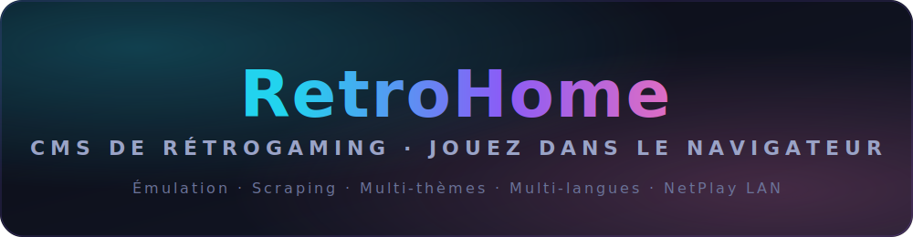

<p align="center">
  
</p>

<p align="center">
  <b>Un CMS de rétrogaming clé en main : gérez votre collection, scrapez les jaquettes,<br>
  et jouez à vos jeux rétro directement dans le navigateur — seul ou en réseau (NetPlay LAN).</b>
</p>

<p align="center">
  
  
  
  
  
</p>

---

## ✨ Fonctionnalités

- 🎮 **Émulation dans le navigateur** via [EmulatorJS](https://emulatorjs.org) — NES, SNES, Game Boy/GBA, Genesis, Arcade, Atari, et bien plus.
- 🕹️ **NetPlay LAN** — jouez à deux (ou plus) sur le même réseau local grâce à un petit serveur Node.js.
- 🖼️ **Scraping automatique** des jaquettes, vidéos et métadonnées via [ScreenScraper.fr](https://www.screenscraper.fr).
- 📦 **Ajout de jeux** manuel, automatique (par ROM) ou **en masse** (scan d'un dossier de ROMs).
- 🎨 **Multi-thèmes** — `aurora` (moderne, par défaut), `classic`, `classic-v2`, `cyberpunk`, `modern`. Changement en un clic depuis l'admin.
- 🌍 **Multi-langues** — Français, English, العربية (RTL), Español, Русский, 中文, avec repli automatique.
- ⭐ **Favoris, notes et profils** utilisateurs.
- 🛠️ **Panneau d'administration** complet : jeux, consoles, scan de ROMs, réglages, thèmes.
- 📱 **Responsive** — pensé mobile, tablette et desktop.

---

## 📸 Aperçu

> Le thème **Aurora** : glassmorphism, dégradés « aurore », typographie moderne.

<p align="center">
  
</p>

*Astuce : déposez vos propres captures dans `docs/` (ex. `docs/home.png`, `docs/game.png`, `docs/admin.png`) et référencez-les ici.*

---

## 🧱 Stack technique

| Côté | Technologies |
|------|--------------|
| Backend | PHP (PDO/MySQL), architecture MVC légère, système de thèmes & de langues |
| Frontend | HTML/CSS (Tailwind + CSS maison), JavaScript vanilla, Font Awesome, Animate.css |
| Émulation | EmulatorJS (moteur + cœurs dans `data/`) |
| NetPlay | Node.js + Socket.IO (WebRTC/relais), dans `netplay-server/` |
| Scraping | API ScreenScraper.fr |

---

## 🚀 Installation (WAMP / XAMPP / LAMP)

### Prérequis
- **PHP 7.4+** avec l'extension `pdo_mysql`
- **MySQL / MariaDB**
- **Apache** avec `mod_rewrite` activé (URLs propres)
- **Node.js 16+** *(optionnel — uniquement pour le NetPlay)*

### Étapes

```bash
# 1. Récupérer le projet dans votre racine web (ex. WAMP)
git clone https://github.com/<votre-compte>/retrohome.git
cd retrohome
```

**2. Créer la base de données et la configuration**

Deux options :

- **A. Installeur guidé (recommandé)** — ouvrez `http://localhost/retrohome/install/`
  et laissez-vous guider (base de données, compte admin, ScreenScraper). L'installeur
  importe `sql/schema.sql` et génère automatiquement `config.local.php`.

- **B. Manuelle**
  ```bash
  # Importer le schéma propre
  mysql -u root -p -e "CREATE DATABASE retro CHARACTER SET utf8mb4;"
  mysql -u root -p retro < sql/schema.sql

  # Créer votre configuration locale (identifiants MySQL)
  cp config.example.php config.local.php
  # …puis éditez config.local.php
  ```

**3. Activer le rewrite Apache** — assurez-vous que `AllowOverride All` est actif pour le
dossier, et que `mod_rewrite` est chargé (le fichier `.htaccess` fait le reste).

**4. Ajouter vos jeux** — connectez-vous, allez dans **/admin**, puis :
- déposez vos ROMs dans `roms/<console>/` ,
- utilisez **Ajout automatique** ou **Scan de ROMs** pour scraper jaquettes & infos.

> ⚠️ **RetroHome ne fournit aucune ROM ni BIOS.** Vous devez fournir vos propres
> fichiers, dont vous possédez légalement les droits. Voir la section [Légal](#-mentions-légales).

---

## 🌐 NetPlay LAN — jouer avec vos amis

Le NetPlay permet de jouer à plusieurs sur le **même réseau local** (Wi‑Fi/LAN).

### 1. Démarrer le serveur (sur le PC hôte)

```bash
# Double-cliquez sur START_NETPLAY.bat (Windows)
# — ou —
cd netplay-server
npm install      # première fois uniquement
node server.js
```

Le serveur affiche l'adresse à partager, par ex. `http://192.168.1.20:3000`.
Autorisez le **port 3000** dans le pare-feu Windows si demandé.

### 2. Jouer

Le netplay utilise le **menu intégré d'EmulatorJS** (relais serveur, fiable en LAN) :

1. **Hôte** : ouvrez un jeu → bouton **NETPLAY** (ou l'icône réseau de la barre de l'émulateur) →
   **Create a room** → donnez un nom.
2. **Ami** : ouvrez **le même jeu** → **NETPLAY** → la room de l'hôte apparaît dans la **liste** →
   cliquez sur **Join**.
3. La partie se synchronise automatiquement. Le bouton **?** dans le jeu rappelle ces étapes.

**Comment ça marche (lockstep déterministe)** : à la connexion, l'invité reçoit l'état exact du
jeu de l'hôte, puis les deux émulateurs échangent leurs **inputs numérotés par frame** et
n'avancent que lorsque les inputs de l'autre joueur sont arrivés. Les deux machines exécutent
ainsi strictement les mêmes frames — la désynchronisation est impossible sur les cœurs
déterministes. Un resync complet de sécurité a lieu toutes les 2 minutes. Le prix : ~83 ms de
latence d'input (standard du lockstep), imperceptible en LAN.

> **Il n'est pas nécessaire d'activer le HTTPS** : le netplay passe par Socket.IO (relais serveur),
> pas par WebRTC en contexte sécurisé.

**Configuration réseau :**
- Par défaut, le client contacte `http://<hôte>:3000`. Pour cibler une autre machine, définissez
  `netplay_url` dans les **réglages admin** (ex. `http://192.168.1.20:3000`).
- **Pour jouer depuis un autre PC**, l'ami ouvre simplement le site via l'**IP de l'hôte**
  (ex. `http://192.168.1.20/retrohome`). `SITE_URL` s'adapte automatiquement à l'hôte utilisé —
  aucun réglage manuel n'est nécessaire, les jeux et l'API se chargent correctement pour chacun.

### 3. Rubrique « Multiplayer »
Le menu **Multiplayer** liste en temps réel les parties NetPlay en cours sur le réseau et permet
de les **rejoindre en un clic**. Les jeux compatibles affichent un badge **MULTI**.

### 🎯 Jeux/systèmes recommandés pour le NetPlay

Le netplay fonctionne mieux avec des cœurs **déterministes** et des jeux **2 joueurs** :

| ✅ Recommandés | ⚠️ À éviter |
|----------------|-------------|
| NES, SNES | Systèmes 3D lourds (PSX, N64, PSP) |
| Game Boy / GBC / GBA | Cœurs non déterministes |
| Sega Genesis / Master System | Jeux 1 joueur uniquement |
| Arcade (FBNeo, MAME 2003) | |

*Tous les cœurs EmulatorJS ne supportent pas le netplay ; privilégiez des jeux de combat/versus.*

---

## 🎨 Thèmes & 🌍 Langues

- **Changer de thème** : **/admin → Thèmes**. Le thème par défaut est **Aurora**.
- **Créer un thème** : dupliquez un dossier de `themes/`, adaptez `theme.json` et `style.css`.
- **Langue** : sélecteur intégré (drapeau) ; les clés manquantes basculent automatiquement
  vers l'anglais puis le français, donc l'interface reste toujours lisible.

---

## 📁 Structure du projet

```
retrohome/
├── admin/              Panneau d'administration (jeux, consoles, scan, réglages…)
├── data/               Moteur EmulatorJS (cœurs, loader) — data/bios & roms exclus du dépôt
├── includes/           Settings, ThemeManager, LanguageManager…
├── lang/               Fichiers de traduction (fr, en, ar, es, ru, zh)
├── netplay-server/     Serveur Node.js Socket.IO pour le NetPlay
├── public/             CSS/JS/vendors partagés (dont emulator.js, script.js)
├── roms/               Vos ROMs (non versionnées)
├── sql/schema.sql      Schéma de base de données propre (pour l'installation)
├── templates/          Templates de secours
├── themes/             Thèmes : aurora, classic, classic-v2, cyberpunk, modern
├── config.php          Bootstrap (charge config.local.php)
└── config.example.php  Modèle de configuration
```

---

## ⚖️ Mentions légales

RetroHome est un **outil de gestion et d'émulation**. Il **ne contient et ne distribue
aucune ROM ni aucun BIOS**. Vous êtes seul responsable des fichiers que vous ajoutez :
n'utilisez que des jeux et BIOS dont vous détenez légalement une copie. Les marques et
œuvres citées appartiennent à leurs ayants droit respectifs.

---

## 🙏 Crédits

- [**EmulatorJS**](https://github.com/EmulatorJS/EmulatorJS) — moteur d'émulation navigateur
- [**ScreenScraper.fr**](https://www.screenscraper.fr) — base de données de scraping
- [**Font Awesome**](https://fontawesome.com), [**Tailwind CSS**](https://tailwindcss.com), [**Animate.css**](https://animate.style), [**Socket.IO**](https://socket.io)

---

## 📄 Licence

Code source sous licence **MIT** — voir [LICENSE](LICENSE).
Les composants tiers et le contenu (ROMs/BIOS) conservent leurs licences respectives.

---

<details>
<summary><b>🇬🇧 English summary</b></summary>

### RetroHome — a turnkey retro-gaming CMS

Manage your retro game collection, scrape cover art & metadata (ScreenScraper), and
**play games straight in the browser** (via EmulatorJS) — solo or with friends over **LAN NetPlay**.

**Features:** browser emulation (NES/SNES/GB/GBA/Genesis/Arcade…), LAN NetPlay, automatic
scraping, bulk ROM import, multiple themes (default **Aurora**), 6 languages with fallback,
favorites/ratings/profiles, full admin panel, responsive design.

**Install (WAMP/XAMPP/LAMP):**
1. `git clone … && cd retrohome`
2. Open `http://localhost/retrohome/install/` (guided) — or import `sql/schema.sql` and
   copy `config.example.php` → `config.local.php`.
3. Enable Apache `mod_rewrite`.
4. Log in, go to **/admin**, drop ROMs into `roms/<console>/`, then use **Auto add** / **ROM scan**.

**NetPlay:** run `START_NETPLAY.bat` (or `cd netplay-server && npm install && node server.js`),
open a game → **NETPLAY** → **Host**/**Join** with a room code (same game required, same LAN).
Best with deterministic 2-player cores (NES, SNES, GB/GBA, Genesis, Arcade).

> ⚠️ RetroHome ships **no ROMs or BIOS**. Provide your own, legally owned files.

**License:** MIT (source code only). Third-party components and game content keep their own licenses.

</details>
