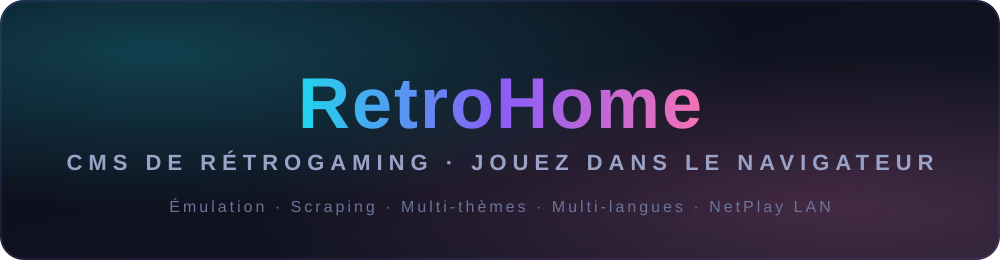
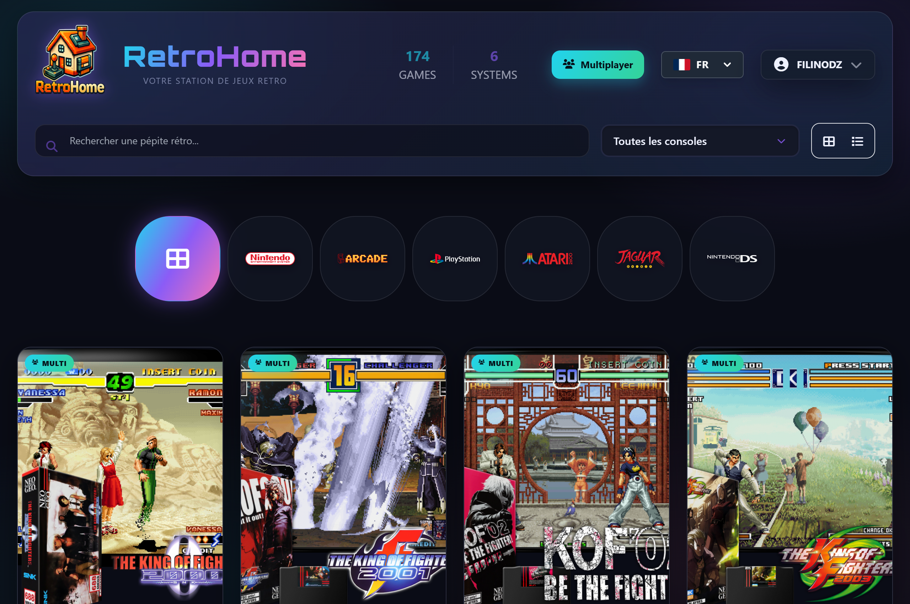
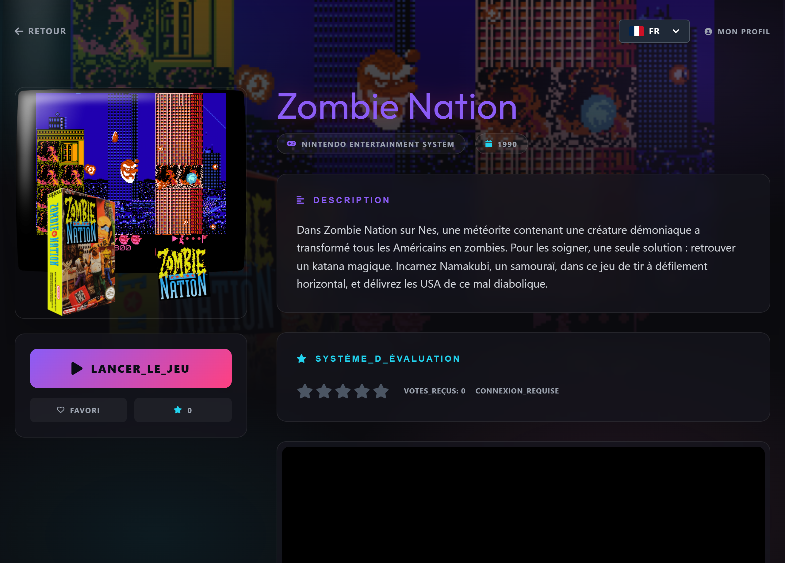
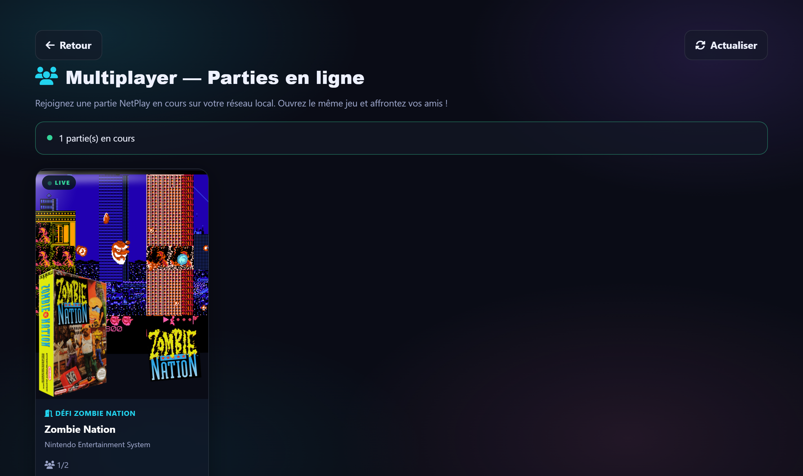
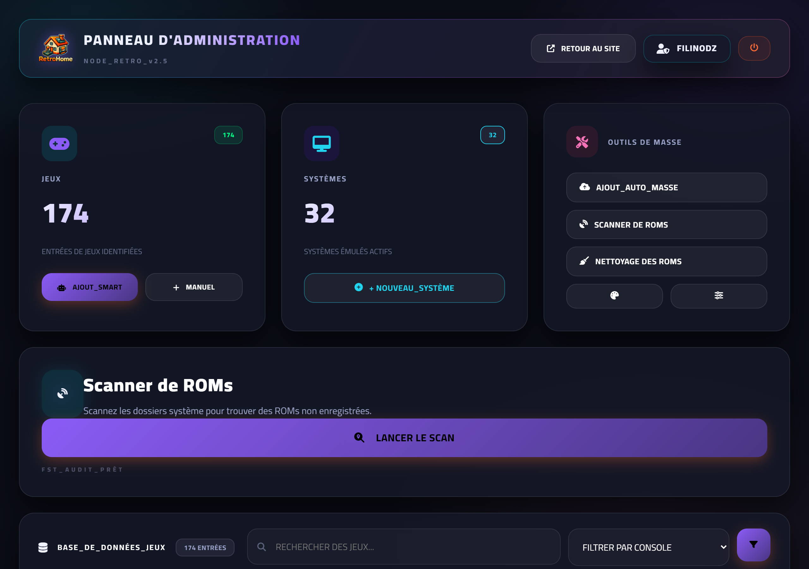
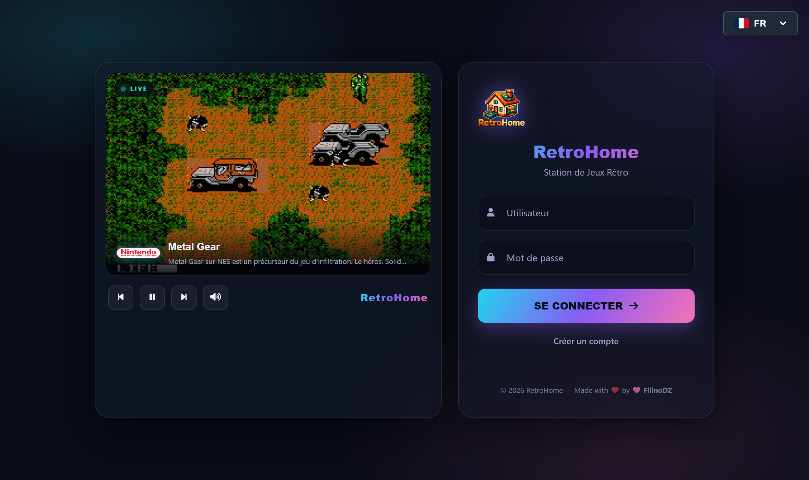

<p align="center">
  
</p>

<p align="center">
  <b>Un CMS de rétrogaming clé en main : gérez votre collection, scrapez les jaquettes,<br>
  et jouez à vos jeux rétro directement dans le navigateur — seul ou en réseau (NetPlay LAN).</b>
</p>

<p align="center">
  
  
  
  
  
</p>

---

## ✨ Fonctionnalités

- 🎮 **Émulation dans le navigateur** via [EmulatorJS](https://emulatorjs.org) — NES, SNES, Game Boy/GBA, Genesis, Arcade, Atari, et bien plus.
- 🕹️ **NetPlay LAN** — jouez à deux (ou plus) sur le même réseau local grâce à un petit serveur Node.js.
- 🖼️ **Scraping automatique** des jaquettes, vidéos et métadonnées via [ScreenScraper.fr](https://www.screenscraper.fr).
- 📦 **Ajout de jeux** manuel, automatique (par ROM) ou **en masse** (scan d'un dossier de ROMs).
- 🎨 **Multi-thèmes** — `aurora` (moderne, par défaut), `classic`, `classic-v2`, `cyberpunk`, `modern`. Changement en un clic depuis l'admin.
- 🌍 **Multi-langues** — Français, English, العربية (RTL), Español, Русский, 中文, avec repli automatique.
- ⭐ **Favoris, notes et profils** utilisateurs.
- 🛠️ **Panneau d'administration** complet : jeux, consoles, scan de ROMs, réglages, thèmes.
- 📱 **Responsive** — pensé mobile, tablette et desktop.

---

## 📸 Aperçu

Le thème **Aurora** (par défaut) : glassmorphism, dégradés « aurore », typographie moderne.

### 🏠 Bibliothèque de jeux
<p align="center"></p>

### 🎮 Fiche de jeu
<p align="center"></p>

### 🕹️ Multiplayer — lobby des parties en ligne
<p align="center"></p>

### 🛠️ Panneau d'administration
<p align="center"></p>

### 🔐 Connexion
<p align="center"></p>

---

## 🧱 Stack technique

| Côté | Technologies |
|------|--------------|
| Backend | PHP (PDO/MySQL), architecture MVC légère, système de thèmes & de langues |
| Frontend | HTML/CSS (Tailwind + CSS maison), JavaScript vanilla, Font Awesome, Animate.css |
| Émulation | EmulatorJS (moteur + cœurs dans `data/`) |
| NetPlay | Node.js + Socket.IO (relais) dans `netplay-server/` + lockstep déterministe côté navigateur |
| Scraping | API ScreenScraper.fr |

---

## 🚀 Installation (WAMP / XAMPP / LAMP)

### Prérequis
- **PHP 7.4+** (8.x recommandé) avec les extensions `pdo_mysql`, `curl` et `gd`
- **MySQL / MariaDB**
- **Apache** avec `mod_rewrite` activé et `AllowOverride All` sur le dossier
- **Node.js 16+** *(uniquement pour le NetPlay)*

### En 3 étapes

```bash
# 1. Récupérer le projet dans votre racine web (ex. C:\wamp64\www ou /var/www/html)
git clone https://github.com/filinodz/retrohome.git
```

**2. Ouvrir le site** — `http://localhost/retrohome/` : tant que RetroHome n'est pas installé,
vous êtes **redirigé automatiquement vers l'assistant d'installation**. Renseignez la base de
données, le nom du site et le compte administrateur : l'assistant crée la base, importe le schéma
(32 consoles préconfigurées) et génère `config.local.php`.

> 🔒 Une fois l'installation terminée, l'assistant se **verrouille** : il ne peut plus être relancé
> tant que `config.local.php` existe (impossible de réinitialiser le compte admin à distance).

**3. Ajouter vos jeux** — connectez-vous, ouvrez **/admin** et choisissez :

| Mode | Usage |
|------|-------|
| **Ajout manuel** | vous envoyez la ROM + une jaquette (et une vidéo optionnelle) |
| **Ajout automatique** | vous envoyez la ROM : titre, année, éditeur, description, jaquette et vidéo sont récupérés sur ScreenScraper |
| **Ajout en masse / Scan de ROMs** | déposez vos ROMs dans `roms/<console>/` (ex. `roms/nes/`), lancez le scan : tout est importé et scrapé d'un coup |

<details>
<summary>Installation manuelle (sans l'assistant)</summary>

```bash
mysql -u root -p -e "CREATE DATABASE retro CHARACTER SET utf8mb4;"
mysql -u root -p retro < sql/schema.sql
mysql -u root -p retro < sql/social_migration.sql
cp config.example.php config.local.php   # puis renseignez vos identifiants MySQL
```
Créez ensuite un compte via la page de connexion et passez-le administrateur
(`UPDATE users SET role='admin' WHERE username='…';`).
</details>

### 🖼️ Scraping automatique (ScreenScraper)

L'ajout automatique utilise l'API de [ScreenScraper.fr](https://www.screenscraper.fr), qui exige
des **identifiants développeur** :

1. Créez un compte sur screenscraper.fr, puis demandez un accès API (forum, rubrique *« Demande d'accès API »*).
2. Dans **Admin › Réglages**, saisissez l'**identifiant** et le **mot de passe développeur** reçus
   (et, si vous le souhaitez, votre compte ScreenScraper pour bénéficier de vos quotas).

Sans ces identifiants, l'ajout manuel fonctionne normalement ; l'ajout automatique affiche un
message clair vous invitant à les renseigner. Les identifiants restent **en base de données** :
ils ne sont jamais écrits dans les fichiers du dépôt ni envoyés au navigateur.

> ⚠️ **RetroHome ne fournit aucune ROM ni BIOS.** Vous devez fournir vos propres
> fichiers, dont vous possédez légalement les droits. Voir la section [Légal](#️-mentions-légales).

---

## 🌐 NetPlay LAN — jouer à deux (ou plus) en même temps

Le NetPlay permet de jouer **simultanément** à plusieurs sur le **même réseau local** (Wi‑Fi/LAN) :
l'hôte contrôle le **joueur 1**, son ami le **joueur 2** (jusqu'à 4 joueurs), et chacun voit
exactement la même partie sur son écran.

### 1. Démarrer le serveur (sur le PC hôte)

| Système | Commande |
|---------|----------|
| Windows | double-cliquez sur **`START_NETPLAY.bat`** |
| Linux / macOS | `./START_NETPLAY.sh` |
| Manuel | `cd netplay-server && npm install && npm start` |

Le serveur affiche l'adresse à partager, par ex. `http://192.168.1.20:3000`.
Autorisez le **port 3000/TCP** dans le pare-feu si demandé.

### 2. Jouer

1. **Hôte** : ouvrez un jeu → **NETPLAY** → *Create a room* → donnez un nom
   (et un **mot de passe** si vous voulez une partie privée).
2. **Ami** : ouvrez le site via l'**IP de l'hôte** (ex. `http://192.168.1.20/retrohome`), puis
   - soit la page **Multiplayer**, qui liste les parties en cours → **Rejoindre** ;
   - soit **le même jeu** → **NETPLAY** → *Join*.
3. La partie se synchronise automatiquement (« NETPLAY : partie synchronisée — bon jeu ! »).

### Comment ça marche

RetroHome remplace la synchronisation native d'EmulatorJS (non fonctionnelle) par un
**lockstep déterministe** (`public/js/netplay-fix.js`) :

- au démarrage, tous les joueurs chargent **le même état** du jeu et partent ensemble ;
- chaque entrée (bouton pressé) est numérotée par frame et appliquée **à la même frame sur
  toutes les machines** (délai de 4 frames ≈ 67 ms, imperceptible en LAN) ;
- une frame ne s'exécute que lorsque les entrées de tous les joueurs sont connues ;
- toutes les 3 secondes, les machines comparent une empreinte de l'état du jeu : en cas de
  divergence, l'hôte **resynchronise automatiquement** la partie.

Validé par des tests automatisés à deux navigateurs (NES et arcade Neo Geo / MAME 2003+) :
après plus d'une minute de jeu avec les deux joueurs actifs, les deux écrans restent
**identiques au pixel près**.

> Pas besoin de HTTPS : le NetPlay passe par Socket.IO (relais serveur), pas par WebRTC.

**Réseau :** par défaut le client contacte `http://<adresse du site>:3000`. Pour un autre
serveur ou port, renseignez **Admin › Réglages › URL du serveur NetPlay**.

### 🎯 Systèmes recommandés

| ✅ Recommandés | ⚠️ À éviter |
|----------------|-------------|
| NES, SNES, Game Boy / GBC / GBA | Systèmes 3D lourds (PSX, N64, PSP) |
| Sega Genesis / Master System | Jeux 1 joueur uniquement |
| Arcade (FBNeo, MAME 2003+) | |

---

## 🔐 Sécurité

- Assistant d'installation **verrouillé** après usage.
- Mots de passe hachés (`password_hash`), requêtes SQL préparées (PDO).
- Cookie de session `HttpOnly` + `SameSite=Lax`, **jetons anti-CSRF** sur les suppressions.
- Fichiers envoyés filtrés (liste blanche d'extensions de ROM, extension des images déduite de
  leur contenu) et **exécution de scripts interdite** dans `roms/` et `assets/`.
- Identifiants (MySQL, ScreenScraper) hors du dépôt : `config.local.php` (ignoré par git) et base de données.

---

## 🎨 Thèmes & 🌍 Langues

- **Changer de thème** : **/admin → Thèmes**. Le thème par défaut est **Aurora**.
- **Créer un thème** : dupliquez un dossier de `themes/`, adaptez `theme.json` et `style.css`.
- **Langue** : sélecteur intégré (drapeau) ; les clés manquantes basculent automatiquement
  vers l'anglais puis le français, donc l'interface reste toujours lisible.

---

## 📁 Structure du projet

```
retrohome/
├── admin/              Panneau d'administration (jeux, consoles, scan, réglages…)
├── data/               Moteur EmulatorJS (cœurs, loader) — data/bios & roms exclus du dépôt
├── includes/           Settings, ThemeManager, LanguageManager…
├── lang/               Fichiers de traduction (fr, en, ar, es, ru, zh)
├── netplay-server/     Serveur NetPlay (Node.js + Socket.IO)
├── public/             CSS/JS/vendors partagés (dont emulator.js, script.js)
├── roms/               Vos ROMs (non versionnées)
├── sql/               Schéma de la base (schema.sql + social_migration.sql)
├── templates/          Templates de secours
├── themes/             Thèmes : aurora, classic, classic-v2, cyberpunk, modern
├── install/           Assistant d'installation
├── config.php          Bootstrap (charge config.local.php)
└── config.example.php  Modèle de configuration
```

---

## ⚖️ Mentions légales

RetroHome est un **outil de gestion et d'émulation**. Il **ne contient et ne distribue
aucune ROM ni aucun BIOS**. Vous êtes seul responsable des fichiers que vous ajoutez :
n'utilisez que des jeux et BIOS dont vous détenez légalement une copie. Les marques et
œuvres citées appartiennent à leurs ayants droit respectifs.

---

## 🙏 Crédits

- [**EmulatorJS**](https://github.com/EmulatorJS/EmulatorJS) — moteur d'émulation navigateur
- [**ScreenScraper.fr**](https://www.screenscraper.fr) — base de données de scraping
- [**Font Awesome**](https://fontawesome.com), [**Tailwind CSS**](https://tailwindcss.com), [**Animate.css**](https://animate.style), [**Socket.IO**](https://socket.io)

---

## 📄 Licence

Code source sous licence **MIT** — voir [LICENSE](LICENSE).
Les composants tiers et le contenu (ROMs/BIOS) conservent leurs licences respectives.

---

<details>
<summary><b>🇬🇧 English summary</b></summary>

### RetroHome — a turnkey retro-gaming CMS

Manage your retro game collection, scrape cover art & metadata (ScreenScraper), and
**play games straight in the browser** (via EmulatorJS) — solo or with friends over **LAN NetPlay**.

**Features:** browser emulation (NES/SNES/GB/GBA/Genesis/Arcade…), LAN NetPlay, automatic
scraping, bulk ROM import, multiple themes (default **Aurora**), 6 languages with fallback,
favorites/ratings/profiles, full admin panel, responsive design.

**Install (WAMP/XAMPP/LAMP):**
1. `git clone https://github.com/filinodz/retrohome.git` into your web root.
2. Open `http://localhost/retrohome/` — you are redirected to the **setup wizard** (database,
   admin account). The wizard locks itself once done.
3. Log in, open **/admin** and add games manually, automatically (ScreenScraper) or in bulk
   (drop ROMs into `roms/<console>/` and run the scan). Automatic scraping needs ScreenScraper
   developer credentials, entered in **Admin › Settings**.

**NetPlay:** run `START_NETPLAY.bat` / `./START_NETPLAY.sh` (or `cd netplay-server && npm install && npm start`).
Host: open a game → **NETPLAY** → create a room (optional password). Friend: **Multiplayer** page
→ **Join** (same LAN). Players play **simultaneously** (player 1, player 2…). A deterministic
lockstep with automatic desync detection keeps every screen identical.

> ⚠️ RetroHome ships **no ROMs or BIOS**. Provide your own, legally owned files.

**License:** MIT (source code only). Third-party components and game content keep their own licenses.

</details>
